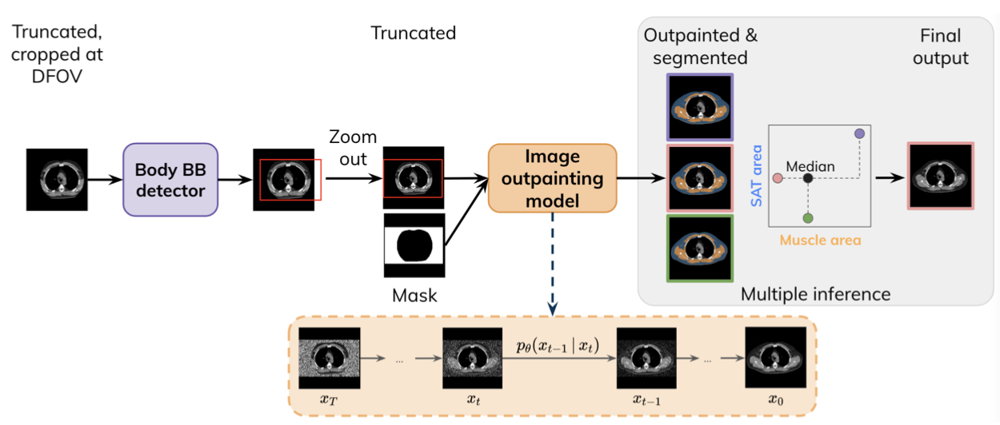
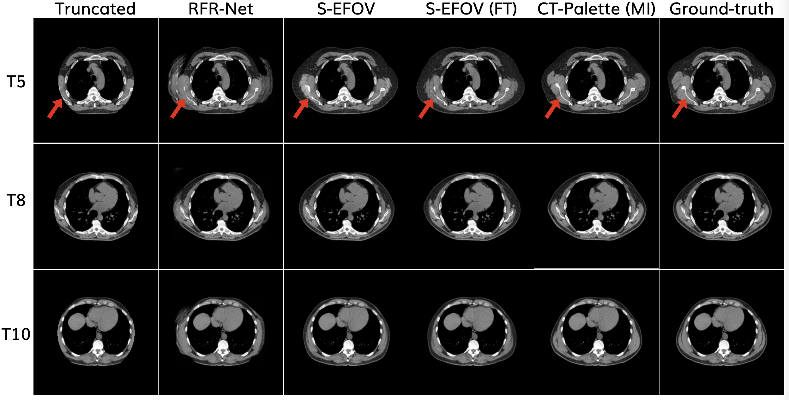
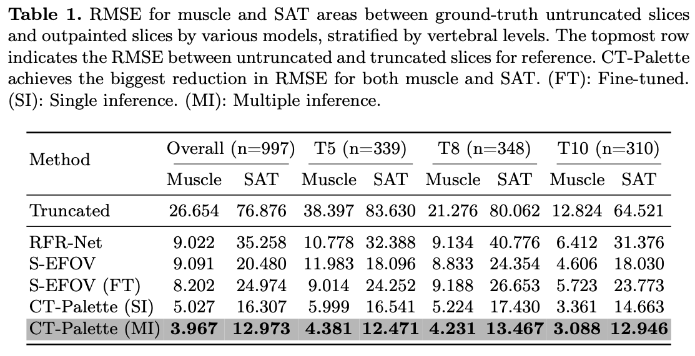

# Diffusion-based Generative Image Outpainting for Recovery of FOV-Truncated CT Images

This is the official PyTorch implementation of CT-Palette (accepted at MICCAI 2024).

[](https://arxiv.org/abs/2406.04769)

> **Diffusion-based Generative Image Outpainting for Recovery of FOV-Truncated CT Images (accepted at MICCAI 2024)** <br>
> Michelle Espranita Liman, Daniel Rueckert, Florian J. Fintelmann †, Philip Müller † <br>

<p align="center">

</p>

> **Abstract:** Field-of-view (FOV) recovery of truncated chest CT scans is crucial for accurate body composition analysis, which involves quantifying skeletal muscle and subcutaneous adipose tissue (SAT) on CT slices. This, in turn, enables disease prognostication. Here, we present a method for recovering truncated CT slices using generative image outpainting. We train a diffusion model and apply it to truncated CT slices generated by simulating a small FOV. Our model reliably recovers the truncated anatomy and outperforms the previous state-of-the-art despite being trained on 87% less data.

CT-Palette is a field-of-view (FOV) extension module that given a FOV-truncated CT slice cropped at the DFOV as input, outputs an untruncated version of that CT slice. It consists of two components:

1. Body bounding box detector: given a FOV-truncated CT slice cropped at the DFOV, predicts the bounding box which covers the extent of the complete/untruncated body if the slice had not been truncated
2. Image outpainting model: recovers the tissues of the truncated CT slice via outpainting

## Outline

1. [Getting Started](#getting-started)
2. [Setup](#setup)
3. [Data Preparation](#data-preparation)
4. [Training](#training)
5. [Inference](#inference)
6. [Results](#results)
7. [Citation](#citation)

## Getting Started

1. Install the required dependencies (Go to "Setup").

2. (Optional) If you want to use our trained models immediately, you can download them [here](https://drive.google.com/drive/folders/1ECOONzuVj1BGgYHvSUoz5-35R2Ddudz6?usp=sharing). Place the body bounding box model in the `models/body_bb_detector` directory and the image outpainting model in the `models/image_outpainting_model` directory. Note: A `config.json` file currently exists in the `models/image_outpainting_model` directory for our trained model. You must replace this with your own model's config after training.

3. Set up the paths in `ct_palette/paths.py`. Especially important is `MAIN_DATA_PATH`, which is where the preprocessed data for training will be stored.

4. If you want to do inference using our trained model (located in the `models` directory), you can jump to the "Inference" section. Otherwise, follow the steps below.

5. Create train.csv, val.csv, and test.csv containing the train, val, and test sets respectively. Each file contains the paths to DICOM files, with "path" as the header. Example:
    ```
    path
    /home/michelle/data/dicom1.dcm
    /home/michelle/data/dicom2.dcm
    ```
    These DICOM files are expected to represent the T5/T8/T10 vertebral levels. Put these files in `<MAIN_DATA_PATH>/data_split`.

6. Prepare the data necessary for training (Go to "Data Preparation").

7. Train the body bounding box detector and the image outpainting model (Go to "Training").

8. Use the trained models for inference (Go to "Inference").

## Setup

1. Create a new Conda environment:
    ```
    conda create -n ct_palette python=3.10
    ```

2. Activate the environment and install the required packages:
    ```
    pip install -r requirements.txt
    ```

3. Install this package:
    ```
    pip install -e .
    ```

## Data Preparation
Warning: Make sure the paths have been correctly configured!

1. Generate the untruncated CT slices, body masks, and lung masks in numpy format from the original DICOM files. This process will be done to all sets: train, val, and test.
    ```
    python ct_palette/data_processing/prepare_data.py
    ```

2. Synthetically truncate the untruncated CT slices and generate the DFOV-cropped truncated CT slices and their corresponding FOV masks and ground-truth body bounding boxes. This process will only be done to the val and test sets. You can adjust the parameters of the synthetic truncation in the script.
    ```
    python ct_palette/data_processing/synthetic_data_generation.py
    ```

## Training

### Body bounding box detector

1. Configure the hyperparameters for training the body bounding box detector in `config/body_bb.yaml`.

2. Execute training:
    ```
    python ctpalette/train/body_bounding_box_detector.py
    ```
Training results are saved in `<MAIN_DATA_PATH>/mlruns`. (Configure `MAIN_DATA_PATH` in `ctpalette/paths.py`.)

### Image outpainting model

1. Configure the hyperparameters for training the image outpainting model in `config/outpainting_model.json`.

2. Execute training:
    ```
    python ctpalette/train/outpainting_model.py -c config/outpainting_model.json -gpu <gpu-ids> -b <batch-size>
    ```
Training results are saved in the directory configured in `"path"` in the .json config file.

## Inference

Warning: Make sure the paths to the body bounding box detector, the image outpainting model, and the body composition segmentation model (if you are using multiple inference) have been configured!

To use CT-Palette for inference, run:
```
    python inference.py --path_to_dcm <path-to-dcm> --path_to_result_dir <path-to-save-results> [--multiple_inf] --mode [median/mean]
```
- path_to_dcm: Path to the .dcm file that you want to outpaint
- path_to_result_dir: Path to directory where you want to save the resulting outpainted image
- multiple_inf: If True, use multiple inference. Else, use single inference.
- mode: If multiple inference is used, choose "median" or "mean". Else, this is ignored.

By default, this uses our trained model located in the `models` directory. If you have trained your own models, place your models there (including the `config.json` file for the image outpainting model) and change the paths in `ct_palette/paths.py` accordingly.

Note: To allow multiple inference, a body composition segmentation model is required. We are not releasing our model as it is proprietary. We used the following repository to train our segmentation model: https://github.com/CPBridge/ct_body_composition. After training your own segmentation model, you can place it inside `models/seg_model` and specify the path to the model in `seg_model_path` in `ct_palette/paths.py`.

## Results

<p align="center">

</p>

<p align="center">

</p>

## Citation
```
@misc{liman2024diffusionbasedgenerativeimageoutpainting,
      title={Diffusion-based Generative Image Outpainting for Recovery of FOV-Truncated CT Images}, 
      author={Michelle Espranita Liman and Daniel Rueckert and Florian J. Fintelmann and Philip Müller},
      year={2024},
      eprint={2406.04769},
      archivePrefix={arXiv},
      primaryClass={eess.IV},
      url={https://arxiv.org/abs/2406.04769}, 
}
```
